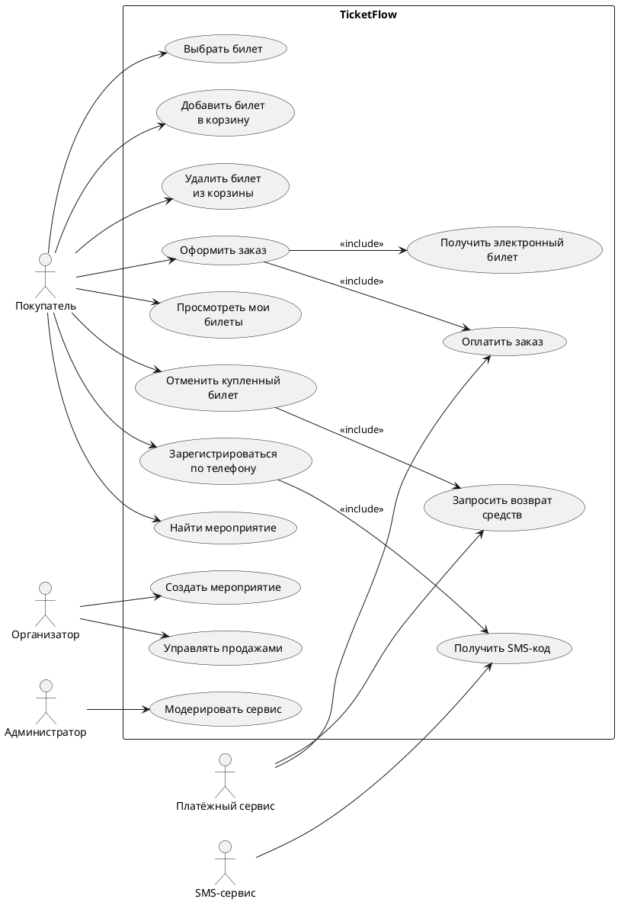
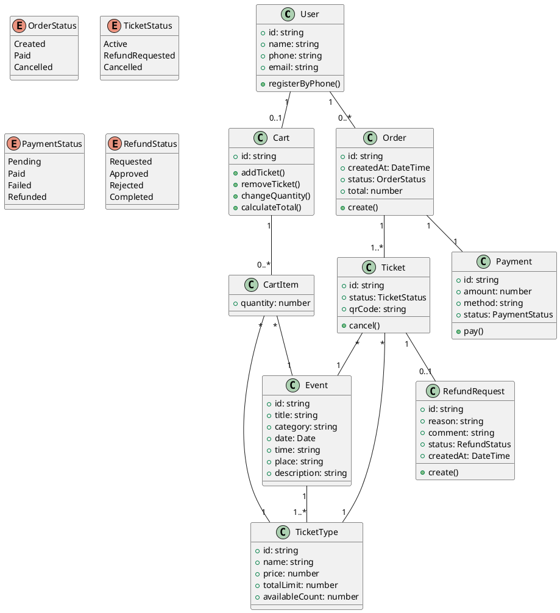
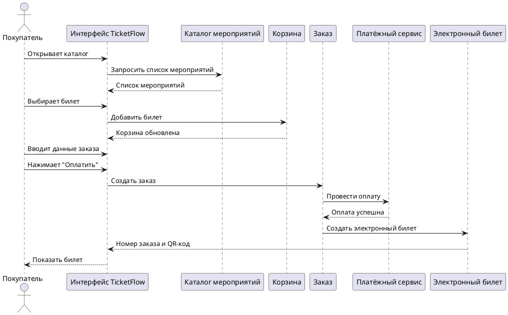
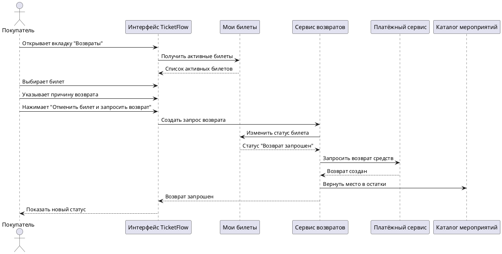
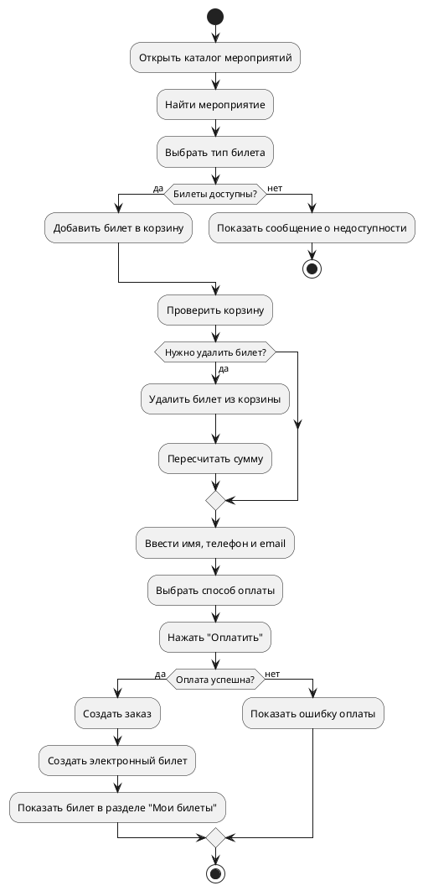
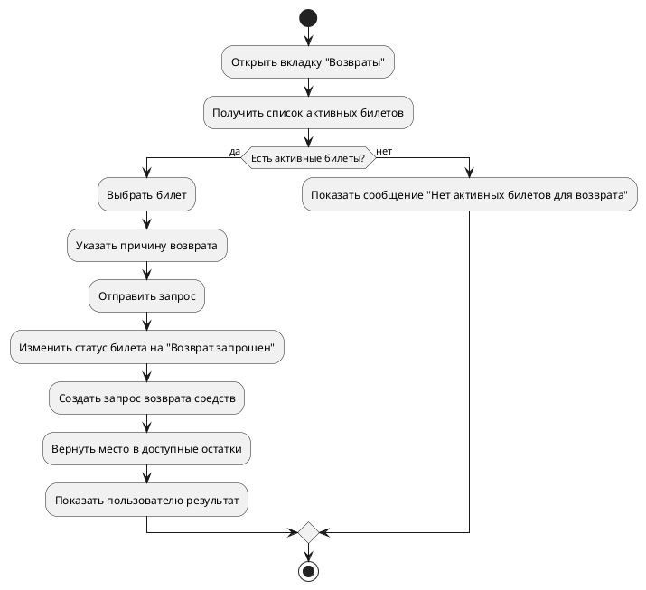

# UML-диаграммы для TicketFlow

Ниже - набор UML-диаграмм в формате PlantUML.

---

## 1. Диаграмма вариантов использования

---

## 2. Диаграмма классов

---

## 3. Диаграмма последовательности: покупка билета

---

## 4. Диаграмма последовательности: отмена билета и возврат

---

## 5. Диаграмма активности: оформление заказа

---

## 6. Диаграмма активности: возврат билета

